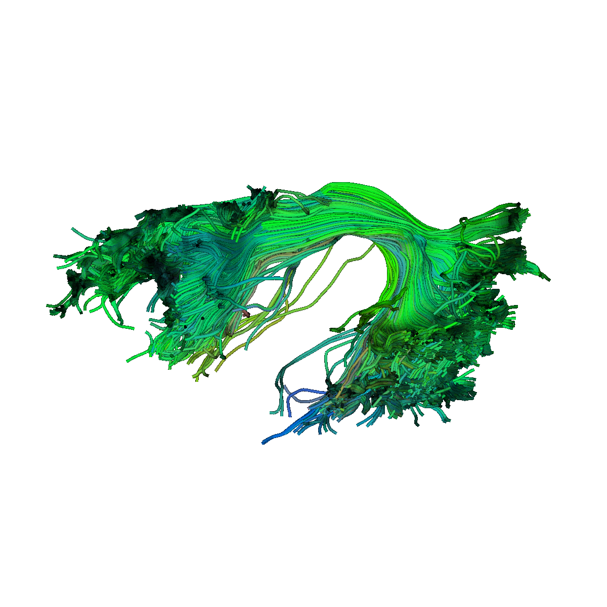
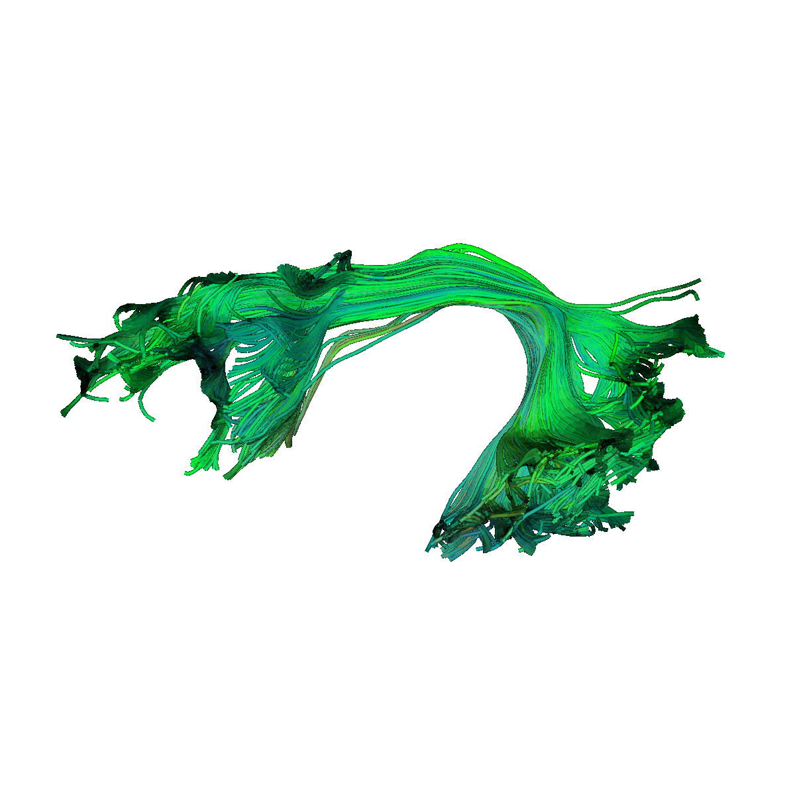

# *BundleCleaner*: Point-cloud based denoising and subsampling of tractography data

*Author*: Yixue Feng

## Running *BundleCleaner* 
- Create conda environment using `conda env create -f environment.yml`.
- Run *BundleCleaner* with the default parameters, `python src/BundleCleanerV2.py -i test_bundles/AF_L.trk -o test_bundles/AF_L_proc.trk`. Add `-v` flag for verbose output.
- Python implementation of select bundle shape metrics defined in DSI Studio [1] are available at `src/BundleInfo.py` ([original implementation](https://github.com/frankyeh/DSI-Studio/blob/fd7a5e8623caf48690fb16f40f6a1ae9ebffd73c/libs/tracking/tract_model.cpp#L2791)).
- Sample bundle from [processed PPMI data](https://nih.figshare.com/articles/dataset/DIPY_Processed_Parkinson_s_Progression_Markers_Initiative_PPMI_Data_Derivatives/12033390) for testing is provided at `test_bundles/AF_L.trk`.

  

    
    <figcaption>AF_L before cleaning</figcaption>
  

  

    
    <figcaption>AF_L after cleaning</figcaption>
  

## References
[1] F.-C. Yeh, “Shape analysis of the human association pathways,” NeuroImage, vol. 223, p. 117329, Dec. 2020, doi: [10.1016/j.neuroimage.2020.117329](https://linkinghub.elsevier.com/retrieve/pii/S1053811920308156).

[2] B. Q. Chandio et al., “Bundle analytics, a computational framework for investigating the shapes and profiles of brain pathways across populations,” Sci Rep, vol. 10, no. 1, p. 17149, Dec. 2020, doi: [10.1038/s41598-020-74054-4](http://www.nature.com/articles/s41598-020-74054-4).

